### Escuela Colombiana de Ingeniería
### Arquitecturas de Software - ARSW

## Escalamiento en Azure con Maquinas Virtuales, Sacale Sets y Service Plans

### Dependencias
* Cree una cuenta gratuita dentro de Azure. Para hacerlo puede guiarse de esta [documentación](https://azure.microsoft.com/en-us/free/search/?&ef_id=Cj0KCQiA2ITuBRDkARIsAMK9Q7MuvuTqIfK15LWfaM7bLL_QsBbC5XhJJezUbcfx-qAnfPjH568chTMaAkAsEALw_wcB:G:s&OCID=AID2000068_SEM_alOkB9ZE&MarinID=alOkB9ZE_368060503322_%2Bazure_b_c__79187603991_kwd-23159435208&lnkd=Google_Azure_Brand&dclid=CjgKEAiA2ITuBRDchty8lqPlzS4SJAC3x4k1mAxU7XNhWdOSESfffUnMNjLWcAIuikQnj3C4U8xRG_D_BwE). Al hacerlo usted contará con $200 USD para gastar durante 1 mes.

### Parte 0 - Entendiendo el escenario de calidad

Adjunto a este laboratorio usted podrá encontrar una aplicación totalmente desarrollada que tiene como objetivo calcular el enésimo valor de la secuencia de Fibonnaci.

**Escalabilidad**
Cuando un conjunto de usuarios consulta un enésimo número (superior a 1000000) de la secuencia de Fibonacci de forma concurrente y el sistema se encuentra bajo condiciones normales de operación, todas las peticiones deben ser respondidas y el consumo de CPU del sistema no puede superar el 70%.

### Parte 1 - Escalabilidad vertical

1. Diríjase a el [Portal de Azure](https://portal.azure.com/) y a continuación cree una maquina virtual con las características básicas descritas en la imágen 1 y que corresponden a las siguientes:
    * Resource Group = SCALABILITY_LAB
    * Virtual machine name = VERTICAL-SCALABILITY
    * Image = Ubuntu Server 
    * Size = Standard B1ls
    * Username = scalability_lab
    * SSH publi key = Su llave ssh publica


2. Para conectarse a la VM use el siguiente comando, donde las `x` las debe remplazar por la IP de su propia VM.

    `ssh scalability_lab@xxx.xxx.xxx.xxx`

3. Instale node, para ello siga la sección *Installing Node.js and npm using NVM* que encontrará en este [enlace](https://linuxize.com/post/how-to-install-node-js-on-ubuntu-18.04/).
4. Para instalar la aplicación adjunta al Laboratorio, suba la carpeta `FibonacciApp` a un repositorio al cual tenga acceso y ejecute estos comandos dentro de la VM:

    `git clone <your_repo>`

    `cd <your_repo>/FibonacciApp`

    `npm install`

5. Para ejecutar la aplicación puede usar el comando `npm FibinacciApp.js`, sin embargo una vez pierda la conexión ssh la aplicación dejará de funcionar. Para evitar ese compartamiento usaremos *forever*. Ejecute los siguientes comando dentro de la VM.

    `npm install forever -g`

    `forever start FibinacciApp.js`

6. Antes de verificar si el endpoint funciona, en Azure vaya a la sección de *Networking* y cree una *Inbound port rule* tal como se muestra en la imágen. Para verificar que la aplicación funciona, use un browser y user el endpoint `http://xxx.xxx.xxx.xxx:3000/fibonacci/6`. La respuesta debe ser `The answer is 8`.


7. La función que calcula en enésimo número de la secuencia de Fibonacci está muy mal construido y consume bastante CPU para obtener la respuesta. Usando la consola del Browser documente los tiempos de respuesta para dicho endpoint usando los siguintes valores:
    * 1000000
    * 1010000
    * 1020000
    * 1030000
    * 1040000
    * 1050000
    * 1060000
    * 1070000
    * 1080000
    * 1090000 

#### Tiempos de respuesta    
* 1000000  
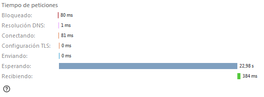  
* 1010000  
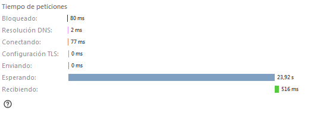  
* 1020000  
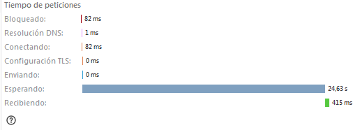  
* 1030000  
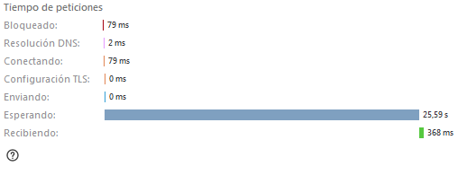  
* 1040000  
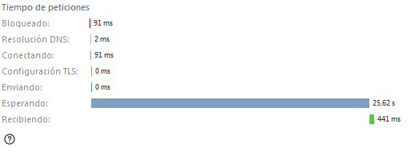  
* 1050000  
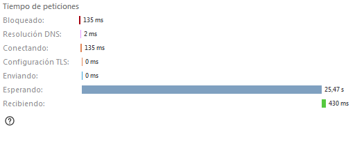  
* 1060000  
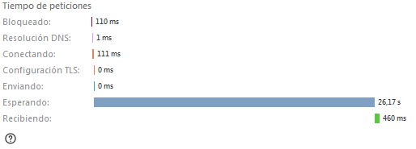  
* 1070000  
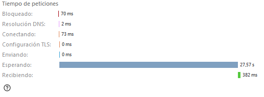  
* 1080000  
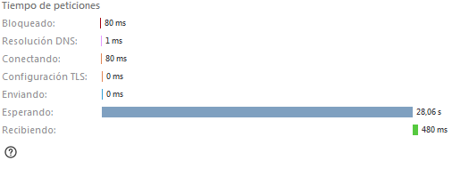  
* 1090000  
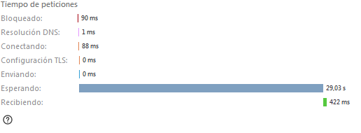  

8. Dírijase ahora a Azure y verifique el consumo de CPU para la VM. (Los resultados pueden tardar 5 minutos en aparecer).


9. Ahora usaremos Postman para simular una carga concurrente a nuestro sistema. Siga estos pasos.
    * Instale newman con el comando `npm install newman -g`. Para conocer más de Newman consulte el siguiente [enlace](https://learning.getpostman.com/docs/postman/collection-runs/command-line-integration-with-newman/).
    * Diríjase hasta la ruta `FibonacciApp/postman` en una maquina diferente a la VM.
    * Para el archivo `[ARSW_LOAD-BALANCING_AZURE].postman_environment.json` cambie el valor del parámetro `VM1` para que coincida con la IP de su VM.
    * Ejecute el siguiente comando.

    ```
    newman run ARSW_LOAD-BALANCING_AZURE.postman_collection.json -e [ARSW_LOAD-BALANCING_AZURE].postman_environment.json -n 10 &
    newman run ARSW_LOAD-BALANCING_AZURE.postman_collection.json -e [ARSW_LOAD-BALANCING_AZURE].postman_environment.json -n 10
    ```

10. La cantidad de CPU consumida es bastante grande y un conjunto considerable de peticiones concurrentes pueden hacer fallar nuestro servicio. Para solucionarlo usaremos una estrategia de Escalamiento Vertical. En Azure diríjase a la sección *size* y a continuación seleccione el tamaño `B2ms`.


11. Una vez el cambio se vea reflejado, repita el paso 7, 8 y 9.
12. Evalue el escenario de calidad asociado al requerimiento no funcional de escalabilidad y concluya si usando este modelo de escalabilidad logramos cumplirlo.   
    * El sistema es escalable y generalmente se comportó de manera más eficiente durante el incremento de workload puesto por postman.
13. Vuelva a dejar la VM en el tamaño inicial para evitar cobros adicionales.

**Preguntas**

1. ¿Cuántos y cuáles recursos crea Azure junto con la VM?  
Los recursos que crea Azure junto a la máquina virtual son:  
    * Resource Group
    * Storage account
    * Virtual Network
    * Public IP address
    * Network interface
    * Data disks
2. ¿Brevemente describa para qué sirve cada recurso?  

* Resource group: Es una agrupación de recursos utilizados por una solución en Azure, son todos aquellos recursos     administrables agrupados, los recursos que se agrupan de esta manera se deciden teniendo en cuenta que es lo mas    
conveniente para nuestra finalidad.  

* Storage account: Cuenta que contiene todos los objetos de almacenamiento de Azure, como blobs, archivos, filas y tablas.  
Esta cuenta provee un espacio que puede ser accedido desde cualquier parte a través de HTTP o HTTPS.  

* Virtual network: Cumple la misma función que cumpliría una red común en un sistema, en este caso, la maquina virtual  
de Azure trae su propia red integrada con sus propios beneficios de escalabilidad, disponibilidad y aislamiento.

* Public IP address: Es una dirección IP publica que permite la comunicación de los recursos de Azure con el internet. Estas  
son asignadas de manera dinámica y pueden ser cambiadas por el usuario.  

* Data disk: Discos de almacenamiento similares a los discos físicos comúnmente conocidos pero virtualizados.


3. ¿Al cerrar la conexión ssh con la VM, por qué se cae la aplicación que ejecutamos con el comando `npm FibonacciApp.js`? ¿Por qué debemos crear un *Inbound port rule* antes de acceder al servicio?  

Al cerrar la conexión SSH prácticamente estamos "cerrando la consola" que está ejecutando FibonacciApp.js por medio del  
comando npm. Por otro lado el *"Inbound port rule"* debe ser creado para que la máquina virtual admita conexiones al  
puerto por el cual la aplicación da las respuestas, en este caso, el puerto 3000.  


4. Adjunte tabla de tiempos e interprete por qué la función tarda tando tiempo.  

Tabla utilizando el tamaño B1|s 

| Tiempo (seg)      | Número Fibonacci |
| ----------- | ----------- |
| 24,9      | 1000000       |
| 26   | 1010000        |
| 26,7      | 1020000       |
| 27,5   | 1030000        |
| 27,9      | 1040000       |
| 26,2   | 1050000        |
| 26,9      | 1060000       |
| 27,4   | 1070000        |
| 30,1      | 1080000       |
| 31,2   | 1090000        |

5. Adjunte imágen del consumo de CPU de la VM e interprete por qué la función consume esa cantidad de CPU.  

Luego de revisar detenidamente la función que calcula los números fibonacci, se puede ver que esta hace uso de un ciclo  
el cual se ve expuesto a una carga muy elevada de iteración para calcular un numero fibonacci grande.

 

6. Adjunte la imagen del resumen de la ejecución de Postman. Interprete:
    * Tiempos de ejecución de cada petición.  
    Utilizando el tamaño B2ms de la máquina virtual
     
    * Si hubo fallos documentelos y explique.  
    
7. ¿Cuál es la diferencia entre los tamaños `B2ms` y `B1ls` (no solo busque especificaciones de infraestructura)?  

La alternativa de máquina virtual con tamaño B2ms es considerablemente mejor que la de tamaño B1|s, esto no solo se aprecia  
en la diferencia de memoria RAM, sino más importante aún, en el desempeño del procesador, el cual es el componente principal  
a la hora hacer la cantidad de cálculos necesarios para llegar a un número fibonacci tan grande, la máquina virtual B2ms  
tiene 2 procesadores virtuales, los cuales inicialmente tienen un desempeño base de 40% que llega a un desempeño máximo del  
200%, mientras que la maquina B1|s solamente cuenta con un procesador virtual, el cual tiene un desempeño inicial del 5%  
y alcanza un desempeño máximo del 100%.  


8. ¿Aumentar el tamaño de la VM es una buena solución en este escenario?, ¿Qué pasa con la FibonacciApp cuando cambiamos el tamaño de la VM?  

Aunque al aumentar el tamaño de la máquina virtual impacto positivamente al tiempo de respuesta de la aplicación, pienso  
que desde un punto de vista más practico sería mucho mejor cambiar la implementación de cómo se calcula el numero fibonacci  
teniendo en cuenta que existen maneras más optimas de obtener dichos números, como por ejemplo por medio de la formula  
o la programación dinámica.  
Por otro lado, cuando cambiamos el tamaño de la máquina virtual, todo el sistema cuenta con más poder de procesamiento  
por lo cual el programa itera mucho más rápido el ciclo principal que calcula el numero fibonacci.  

9. ¿Qué pasa con la infraestructura cuando cambia el tamaño de la VM? ¿Qué efectos negativos implica?  

Cambiar abruptamente el tamaño de la máquina virtual va a implicar una interrupción en el servicio de cálculo de números  
fibonacci, lo cual disminuye el "uptime" de la infraestructura.  

10. ¿Hubo mejora en el consumo de CPU o en los tiempos de respuesta? Si/No ¿Por qué?  

Si se pudo apreciar una mejora del uso del CPU, porque el tamaño B1|s tiene que dedicar muchos más recursos para realizar  
el cálculo de los números fibonacci, contrario a la máquina de tamaño B2ms que consume muchos menos recursos para hacer  
lo mismo en un tiempo menor.  

11. Aumente la cantidad de ejecuciones paralelas del comando de postman a `4`. ¿El comportamiento del sistema es porcentualmente mejor?  


### Parte 2 - Escalabilidad horizontal

#### Crear el Balanceador de Carga

Antes de continuar puede eliminar el grupo de recursos anterior para evitar gastos adicionales y realizar la actividad en un grupo de recursos totalmente limpio.

1. El Balanceador de Carga es un recurso fundamental para habilitar la escalabilidad horizontal de nuestro sistema, por eso en este paso cree un balanceador de carga dentro de Azure tal cual como se muestra en la imágen adjunta.


2. A continuación cree un *Backend Pool*, guiese con la siguiente imágen.


3. A continuación cree un *Health Probe*, guiese con la siguiente imágen.


4. A continuación cree un *Load Balancing Rule*, guiese con la siguiente imágen.


5. Cree una *Virtual Network* dentro del grupo de recursos, guiese con la siguiente imágen.


#### Crear las maquinas virtuales (Nodos)

Ahora vamos a crear 3 VMs (VM1, VM2 y VM3) con direcciones IP públicas standar en 3 diferentes zonas de disponibilidad. Después las agregaremos al balanceador de carga.

1. En la configuración básica de la VM guíese por la siguiente imágen. Es importante que se fije en la "Avaiability Zone", donde la VM1 será 1, la VM2 será 2 y la VM3 será 3.


2. En la configuración de networking, verifique que se ha seleccionado la *Virtual Network*  y la *Subnet* creadas anteriormente. Adicionalmente asigne una IP pública y no olvide habilitar la redundancia de zona.


3. Para el Network Security Group seleccione "avanzado" y realice la siguiente configuración. No olvide crear un *Inbound Rule*, en el cual habilite el tráfico por el puerto 3000. Cuando cree la VM2 y la VM3, no necesita volver a crear el *Network Security Group*, sino que puede seleccionar el anteriormente creado.


4. Ahora asignaremos esta VM a nuestro balanceador de carga, para ello siga la configuración de la siguiente imágen.


5. Finalmente debemos instalar la aplicación de Fibonacci en la VM. para ello puede ejecutar el conjunto de los siguientes comandos, cambiando el nombre de la VM por el correcto

```
git clone https://github.com/daprieto1/ARSW_LOAD-BALANCING_AZURE.git

curl -o- https://raw.githubusercontent.com/creationix/nvm/v0.34.0/install.sh | bash
source /home/vm1/.bashrc
nvm install node

cd ARSW_LOAD-BALANCING_AZURE/FibonacciApp
npm install

npm install forever -g
forever start FibonacciApp.js
```

Realice este proceso para las 3 VMs, por ahora lo haremos a mano una por una, sin embargo es importante que usted sepa que existen herramientas para aumatizar este proceso, entre ellas encontramos Azure Resource Manager, OsDisk Images, Terraform con Vagrant y Paker, Puppet, Ansible entre otras.

#### Probar el resultado final de nuestra infraestructura

1. Porsupuesto el endpoint de acceso a nuestro sistema será la IP pública del balanceador de carga, primero verifiquemos que los servicios básicos están funcionando, consuma los siguientes recursos:

```
http://52.155.223.248/
http://52.155.223.248/fibonacci/1
```

2. Realice las pruebas de carga con `newman` que se realizaron en la parte 1 y haga un informe comparativo donde contraste: tiempos de respuesta, cantidad de peticiones respondidas con éxito, costos de las 2 infraestrucruras, es decir, la que desarrollamos con balanceo de carga horizontal y la que se hizo con una maquina virtual escalada.  

Prueba con newman:  


Como se puede apreciar en la imagen, el tiempo de duración de la prueba fue considerablemente mayor al resultado visto  
en la prueba hecha con la máquina virtual B2ms, viendo que esta última duro 2 minutos con 35.5 segundos y la prueba hecha con  
escalamiento horizontal tuvo una duración de 3 minutos con 59 segundos, con un tiempo promedio de respuesta de 23.8  
segundos, frente a los 15.5 segundos de tiempo promedio de respuesta de la máquina virtual B2ms. Aun así, se puede apreciar  
que ninguna de las dos pruebas tuvo algún error a destacar.  

3. Agregue una 4 maquina virtual y realice las pruebas de newman, pero esta vez no lance 2 peticiones en paralelo, sino que incrementelo a 4. Haga un informe donde presente el comportamiento de la CPU de las 4 VM y explique porque la tasa de éxito de las peticiones aumento con este estilo de escalabilidad.  

```
newman run ARSW_LOAD-BALANCING_AZURE.postman_collection.json -e [ARSW_LOAD-BALANCING_AZURE].postman_environment.json -n 10 &
newman run ARSW_LOAD-BALANCING_AZURE.postman_collection.json -e [ARSW_LOAD-BALANCING_AZURE].postman_environment.json -n 10 &
newman run ARSW_LOAD-BALANCING_AZURE.postman_collection.json -e [ARSW_LOAD-BALANCING_AZURE].postman_environment.json -n 10 &
newman run ARSW_LOAD-BALANCING_AZURE.postman_collection.json -e [ARSW_LOAD-BALANCING_AZURE].postman_environment.json -n 10
```

**Preguntas**

* ¿Cuáles son los tipos de balanceadores de carga en Azure y en qué se diferencian?, ¿Qué es SKU, qué tipos hay y en qué se diferencian?, ¿Por qué el balanceador de carga necesita una IP pública?  
    **Balanceador de carga público:** Un balanceador de carga público tiene la función dar conexiones salientes a las maquinas  
    virtuales, es decir, balancean la carga del tráfico de internet a las máquinas virtuales.  
    **Balanceador de carga privado:** Es usado como una manera para balancear la carga interna del tráfico generado dentro de  
    una máquina virtual.  
    **SKU:** Significa Stock-keeping-unit, lo cual se refiere a una unidad que puede ser comprada junto con otros productos  
    en Azure, también indica que este producto puede venir en diferentes formas.  
    1. **Estandar:** Los SKU estándar pueden ser vendidos individualmente o como partes de colecciones o paquetes.  
    2. **Componente:** Se refiere a las partes incluidas en colecciones y paquetes, no se venden por si solos.  
    3. **Montaje/Assembly:** Es un producto que debe ser ensamblado antes de ser enviado al cliente final.  
    4. **Paquete/Bundle:** Es un producto que incluye otros SKU's asociados y que no necesitan ser ensamblados antes del envió  al cliente final  
    5.  **Coleccion:**  Una colección está asociada a algún producto de marketing, en este caso solo se venden las SKU asociadas  
    6.  **Virtual:** Este tipo de SKU no requiere de una instalación física o de un almacenamiento en inventario, como por  
    ejemplo, una suscripción a una revista.  
    La razón por la cual un balanceador de carga requiere una IP publica, es porque en este caso el endpoint del servicio  
    de calcular números fibonacci es ofrecido al internet, es decir a la red pública, con esta idea podemos concluir que  
    el balanceador de carga de este laboratorio es uno de tipo público. Mediante esta única IP se va a manejar todo el  
    trafico que tendrá que manejar cada una de las máquinas virtuales.    

* ¿Cuál es el propósito del *Backend Pool*?  
    Es un componente del balanceador de carga que define el grupo de recursos que serán usados para servir el trafico  
    sí así lo define una regla de balanceo.  
* ¿Cuál es el propósito del *Health Probe*?  
    Un *"Health Probe"* cumple la función de sondear el estado de los recursos backend. Las respuestas del health probe  
    pueden ser configuradas para determinar que instancia del backend recibirá un nuevo flujo de tráfico. Estas mismas  
    se encargan de detectar fallas en el backend de la aplicación, mediante el uso de estos sondeos podemos incluso gestionar  
    las cargas y el flujo de trabajo en un load balancer.  
* ¿Cuál es el propósito de la *Load Balancing Rule*? ¿Qué tipos de sesión persistente existen, por qué esto es importante y cómo puede afectar la escalabilidad del sistema?.  
    La **Load balancing rule**, es una regla que define la lógica en la que se distribuirá el tráfico entre las diferentes  
    instancias del Backend Pool.  
* ¿Qué es una *Virtual Network*? ¿Qué es una *Subnet*? ¿Para qué sirven los *address space* y *address range*?  
    **Virtual Network:** También llamada VNet, cumple la función de proveer con una red a una máquina virtual, esta permite  
    extender la red de área local al internet. De esta manera, la VNet permite que diferentes recursos de la infraestructura  
    se comuniquen entre sí, entre el internet y entre las demás redes on-premise.  
    **Subnet:** Actúa como un segmento de la *Virtual Network*, es un rango de direcciones IP en una VNet, de manera en que  
    una VNet puede ser dividida en varias subnets, lo cual proporciona una mejor organización y más seguridad en la infraestructura.  
    **Address Space:** El espacio de redes es todo el rango que una IP privada puede tomar en el rango dentro del contexto de  
    una VNet, por ejemplo, si una máquina virtual es desplegada en una VNet con address space configurado de 10.0.0.0/16  
    la máquina virtual podría asignársele la IP privada 10.0.0.4.  
    **Address Range:** La configuración de address range determina cuantas direcciones existirán en un address space.  
* ¿Qué son las *Availability Zone* y por qué seleccionamos 3 diferentes zonas?. ¿Qué significa que una IP sea *zone-redundant*?  
    **Availability Zone:** Es una localización física única dentro de una región, cada una de estas zonas está compuesta de  
    uno o más datacenters proveedores de servicios.  
    La razón de porque se seleccionan 3 zonas distintas dentro de una zona de disponibilidad es para brindarle mas  
    disponibilidad a la infraestructura, lo cual mejora el apartado de requerimientos no funcionales, esto se consigue  
    ya que, si uno de los nodos llega a sufrir un daño o deja de estar disponible, el load balancer podrá seguir utilizando  
    los recursos que si se encuentran funcionando correctamente.  
    **Zone-redundant IP:** Una IP de tipo zone redundant hace que los flujos de entrada o salida sean atendidos por alguna  
    de las zonas de disponibilidad en una región.  

* ¿Cuál es el propósito del *Network Security Group*?  
    **Network Security Group:** Es un mecanismo de seguridad en la red que filtra o permite el paso de tráfico de la red hasta  
    las máquinas virtuales o recursos de Azure, esto mediante el uso de reglas de seguridad que determinan si se permite o se  
    rechaza un tráfico de entrada o de salida a dichos recursos.  
* Informe de newman 1 (Punto 2)  

* Presente el Diagrama de Despliegue de la solución.  

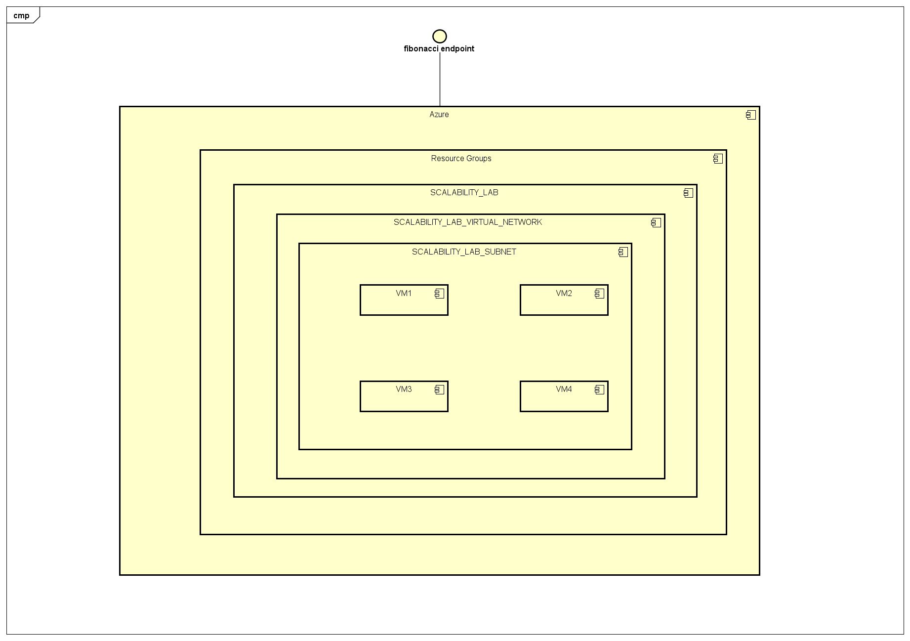